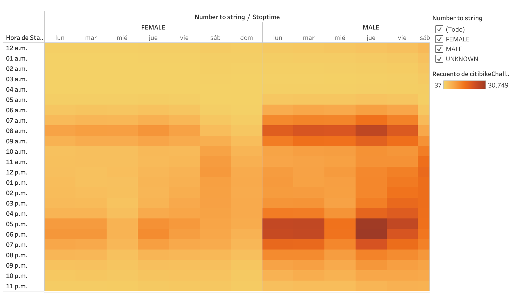

# Bikesharing

[link to story](https://public.tableau.com/app/profile/maria.casas/viz/Challenge14_16327661582970/Historia1?publish=yes)

## Overview of Analysis.

The purpose of this project is to analyze data from the bike-sharing program in New York and use it to create visualizations to show potential investors and assure them this is a good business idea.

## Results.

### August Peak Hours.

First, we created a bar chart to show which are the rental peak hour in August.

As we can see from the chart below peak rental hours are from 7 am to 89 am and from 5 pm to 9 pm. So we can conclude that most people use bikes to commute to work.

### Gender Breakdown.

Once we know the peak hours for bike rentals, we wanted to know our main market, men or women. So we created a pie chart to show who rents more bikes.

As we can see, males are the primary market.

### Bikes due for repair.

Another important aspect of a successful business is maintaining the quality of the bikes so that we won´t have to take them out of the market for a long time.

So our we created a treemap predicting which bikes are due for maintenance based on their rent history.

### Trips by weekday.

To understand more the rental hours by day, we created a heatmap.

With the visualization, we can confirm that workdays are the busiest days.

### Trips by gender.

The next graph we have shows us the average trips on a weekday classified by gender.

As we can see, men on workdays are the main users. 

### Users trips by gender by weekday.

To better understand the market. We created a heatmap, that shows us the frequency of use on a weekday classified by gender and user type.

With this graph, we learned that male subscribers are our primary customers. 

### Trip duration.

An important thig to know is the trip duration average, for that we created a line graph.

This helped us conclude that most bike rides are between 5 and 10 minutes long.

### Trip duration by Gender.

After knowing the average trip duration, we classified the data by gender to figure out who takes longer bike rides.

The conclusion was that in general, males ride longer than women.

## Summary.

After analyzing the data and the visualizations, we can conclude that our main target market is males who use the bikes for their daily commute to work and that generally, those trips don´t take more than 10 minutes.

This information is useful to create a targeted marketing campaign. 

Two other visualizations that would be useful for this purpose are.

- Trip duration by Age
- Users trips by age by weekday.